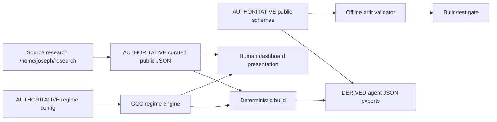

# GCC Landing architecture

## Purpose

GCC Landing is the public Gold Condor site, the GCC historical research surface, and the machine-readable agent economics interface. The product exposes research and deterministic experimental regime context for inspection. It is not a wallet, exchange, execution service, or live capital-control system.

## Runtime architecture

```mermaid
flowchart TD
  Browser[Browser]
  Browser --> Home[/]
  Browser --> About[/about]
  Browser --> Agents[/agents]
  Browser --> Network[/network]
  Network --> Opportunity[public/opportunity.html]
  Opportunity --> UI[public/js/opportunity.mjs]
  UI --> Engine[public/js/gccRegimeEngine.mjs]
  UI --> Visuals[public/js/opportunityVisuals.mjs]
  Engine --> Data[public/data/*.json]
  Data --> Render[Rendered dashboard]
  Visuals --> Render
```

The browser loads `opportunity.html`, then the page module fetches `gcc-regime-config.json`, `gcc-network-research.json`, and `gcc-opportunity-research.json`. The engine produces current unavailable or opt-in illustrative outputs. The visual module renders native SVG/CSS components. The browser never receives a private credential from this repository.

## Deployment architecture

Local Express starts at `server.js` (`npm start`, port 3000 by default). `express.static(public)` exposes direct static files at root URLs. Explicit Express routes map `/about` to `about.html`, `/agents` to `agents.html`, and `/network` to `opportunity.html`; the final Express catch-all serves `index.html` for other paths. `api/winning-nft.js` is a Vercel-style API artifact; local Express also contains equivalent winning-NFT routes.

Vercel reads `vercel.json`. Named rewrites map `/about → /about.html`, `/agents → /agents.html`, `/network → /opportunity.html`, and preserve `/api/(.*)`. There is intentionally no `/public` prefix catch-all: Vercel publishes files under `public/` at root URLs. This keeps `/network` canonical while preserving `/opportunity.html` direct access.

## Data architecture



* **SOURCE RESEARCH** lives outside this repository under `/home/joseph/research/`; the repository copies curated, status-labelled results into `public/data/`.
* **CURATED PUBLIC DATA** is hand-maintained research/network data. `gcc-network-research.json` is the source for 28 metrics, LP results and evidence map. `gcc-opportunity-research.json` carries definitions, provenance and agent metadata.
* **CONFIGURATION** is `gcc-regime-config.json`, authoritative for provisional weights, thresholds, penalties and missing-input policy.
* **SCHEMA** is `gcc-regime-schema.json` for regime outputs and `gcc-opportunity-schema.json` for the future opportunity object. `schemas/schema-registry.json` relates artifacts; it does not duplicate schemas.
* **GENERATED AGENT EXPORTS** are produced by `scripts/build-opportunity.mjs`; they are derived and never authorities. The build also creates ignored `dist/` output.
* **UI PRESENTATION** is `public/opportunity.html`, `opportunity.mjs`, `opportunityVisuals.mjs`, and the two opportunity stylesheets. It does not own research values or score logic.

## Safety boundary

The public dashboard is read-only. This repository has no private keys, wallet signing, transaction broadcast, smart-contract writes, liquidity modification, or agent execution endpoint. Current market inputs are not connected; scores are withheld. The illustrative scenario is synthetic and explicitly labelled. Links to Condor/Concierge services are external boundaries and do not grant this repository authority over them.

## Entry points and products

`public/index.html` is the landing page. `public/about.html` explains GCC, Condor and the research stack. `public/agents.html` explains the agent-facing contract. `public/opportunity.html` is the canonical Opportunity Surface document served through `/network`. `public/network.html` remains the older static/detail research view and is direct-static/legacy. The white paper has PDF, Markdown, and HTML artifacts under `public/white-paper/`.

`scripts/build-opportunity.mjs` regenerates five agent JSON files and a standalone `dist/` copy. `scripts/check-schema-drift.mjs` is an offline architecture gate. Node test files cover engine behavior, output schema, visual data binding and build-produced exports; the browser script adds responsive and route checks when Playwright is supplied.
